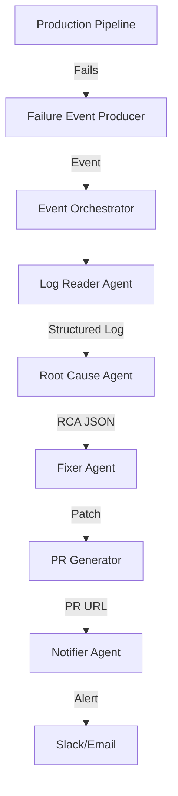

# Architecture

This document details the system design of the Autonomous DataOps Platform.

## High-Level Overview

The platform is designed to autonomously detect, diagnose, and fix data pipeline failures. It leverages a multi-agent architecture where specialized agents handle specific stages of the incident lifecycle.

### Core Components

1.  **Production Pipelines**: Distributed Spark pipelines running on platforms like Dataproc, EMR, or Glue. These are the systems being monitored.
2.  **Failure Event Producer**: An Airflow callback or similar mechanism that captures failure events (DAG ID, Task ID, Log URL) and pushes them to the event bus.
3.  **Event Orchestrator**: A central dispatcher (could be Pub/Sub, Kafka, or a simple Python script) that routes events to the appropriate agents.
4.  **Agents**:
    *   **Log Reader Agent**: Parses raw logs to extract error signatures and structured data. Uses regex patterns and heuristics to classify errors (e.g., OOM, Schema Mismatch).
    *   **Root Cause Agent**: Analyzes the structured log data to determine the root cause. It uses rule-based logic and heuristics to suggest fixes.
    *   **Spark Metrics Agent**: (Optional) Fetches metrics from the Spark History Server to validate resource usage (memory, shuffle, skew).
    *   **Fixer / Optimizer Agent**: Generates code patches using AST transformations (LibCST). It applies safe, deterministic changes like adding broadcast hints or repartitioning.
    *   **PR Generator Agent**: Automates the creation of GitHub Pull Requests with the proposed fixes.
    *   **Notifier Agent**: Sends alerts to communication channels (Slack, Email) with the RCA and PR links.

## Data Flow

1.  **Detection**: A job fails in the production environment.
2.  **Ingestion**: The Failure Event Producer captures the failure and sends an event.
3.  **Analysis**:
    *   The Log Reader Agent pulls the logs.
    *   The Root Cause Agent analyzes the logs and identifies the issue (e.g., "Join Skew").
4.  **Remediation**:
    *   The Fixer Agent receives the RCA and generates a patch (e.g., `df.repartition(200)`).
5.  **Action**:
    *   The PR Generator creates a branch and opens a PR.
    *   The Notifier alerts the team.

## Diagram

